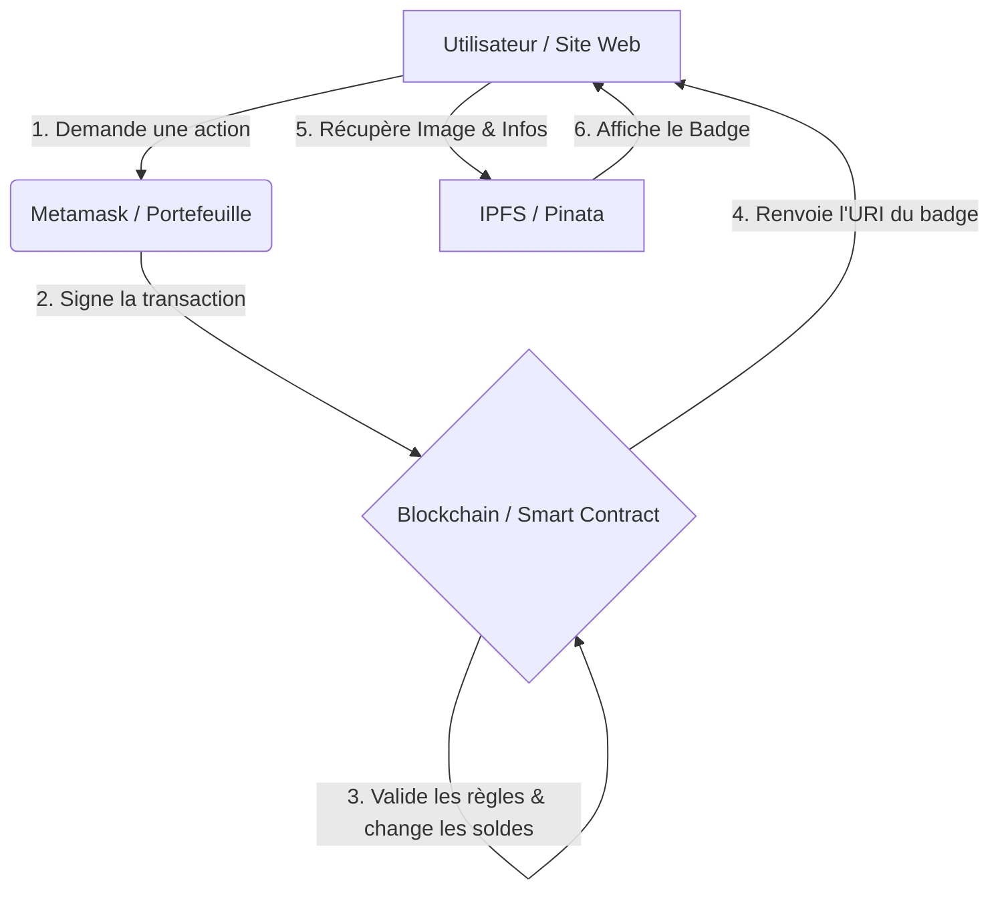

# Préparation à l'Oral : Tout savoir sur SmartCourse

Ce document est ton antisèche pour maîtriser le projet et répondre à n'importe quelle question technique ou métier.

---

## 0. La Vision Globale (Comment ça marche ?)

Avant de plonger dans le code, voici comment les 4 piliers de ton projet discutent entre eux :

### Le flux simplifié :
1.  **L'Interface (Le site)** : C'est ce que tu vois. C'est fait en HTML/JS simple.
2.  **Le Portefeuille (Metamask)** : C'est la clé. Sans lui, le site ne peut pas parler à la blockchain. Il sert d'identité (pas besoin de login/password).
3.  **Le Cœur (Le Smart Contract)** : C'est lui qui contient les "lois" du projet (ex: pas plus de 8 badges). Il est **autonome**. Une fois déployé, personne ne peut changer ses règles.
4.  **Le Stockage (IPFS)** : C'est le "disque dur" décentralisé. Il garde tes images. La blockchain ne contient que des adresses (liens) vers ce disque dur.

---

## 1. Le projet en une phrase
"C'est une plateforme d'accès à des cours sécurisée par la blockchain, où les droits d'entrée sont des badges numériques (NFT) évolutifs et soumis à des règles de sécurité strictes (limites, délais, non-transférabilité)."

---

## 2. La Stack Technique (Le "Comment")
Si on te demande pourquoi ces technos :

*   **Solidity (0.8.28)** : Le langage standard pour les contrats Ethereum. Version récente pour bénéficier des dernières optimisations de sécurité.
*   **Standard ERC-1155** : **Point crucial**. On n'a pas pris l'ERC-721 (NFT classique) car l'ERC-1155 est beaucoup plus efficace. Il permet de gérer des "semi-fongibles" : tu peux avoir 1000 personnes qui possèdent le même Badge Bronze sans créer 1000 contrats. Ça coûte moins cher en frais de gaz.
*   **Hardhat** : C'est notre boîte à outils (framework). Il nous sert à tester, compiler et déployer localement.
*   **Ethers.js (v6)** : La bibliothèque qui fait le pont entre le JavaScript (le site) et Solidity (la blockchain).
*   **IPFS (via Pinata)** : On ne stocke pas les images sur la blockchain (trop cher). On stocke juste un lien (`URI`) qui pointe vers IPFS. C'est décentralisé : si notre serveur tombe, les images restent accessibles via le réseau IPFS.

---

## 3. L'Architecture (On-chain vs Off-chain)
*   **On-chain (Blockchain)** : On n'y met que le strict minimum pour que ce soit immuable : les soldes (qui possède quoi), les verrous temporels (cooldown) et les règles de fusion (upgrade).
*   **Off-chain (IPFS/Web)** : Les images, les descriptions des cours et l'interface visuelle.

---

## 4. Les 3 "Verrous" de Sécurité (Logique métier)
C'est souvent ce que le jury veut tester. Tu dois savoir expliquer ces 3 règles :

1.  **Le Cooldown (1 min)** : Un utilisateur ne peut pas "spammer" le réseau. Après un upgrade ou un transfert, il doit attendre 1 minute.
    *   *Technique* : On stocke le `timestamp` (l'heure exacte) de la dernière action dans un mapping `lastTx`.
2.  **Le Lock (1 min)** : Si tu reçois un badge, il est "gelé" 1 minute. Tu ne peux pas le renvoyer ou l'upgrade tout de suite.
    *   *Pourquoi ?* Pour éviter les manipulations rapides ou les bots.
3.  **La limite de 8** : Personne ne peut avoir plus de 8 badges au total.
    *   *Pourquoi ?* Pour éviter qu'un utilisateur monopolise toutes les ressources ou "pollue" le contrat.

---

## 5. Le badge Gold : Le "Soulbound"
Le badge OR est spécial : il est **non-transferable**.
*   Si on te demande comment on fait : On a "overridé" (réécrit) la fonction `safeTransferFrom` pour qu'elle renvoie une erreur si l'ID est celui du badge Gold.
*   *Concept* : C'est ce qu'on appelle un **Soulbound Token (SBT)**. Il prouve une compétence personnelle qui ne peut pas être vendue.

---

## 6. Les Tests (La preuve que ça marche)
On a 13 tests. Ils ne testent pas seulement si ça marche, ils testent surtout si ça **échoue** quand on essaie de tricher.
*   *Exemple* : On essaie d'upgrade sans avoir assez de badges -> Le test vérifie que le contrat refuse bien l'opération.
*   *Exemple* : On essaie d'envoyer un badge Gold -> Le test vérifie que la transaction est bloquée.

---

## 7. Questions Pièges & Réponses

**Q : Pourquoi ne pas avoir utilisé une base de données classique (SQL) ?**
*R : Pour la transparence et l'immuabilité. Personne, même pas l'admin, ne peut falsifier le fait que j'ai obtenu mon badge. C'est une preuve publique et infalsifiable.*

**Q : Que se passe-t-il si je perds mon wallet Metamask ?**
*R : Comme c'est de la blockchain réelle (simulée ici), les badges sont perdus. L'admin ne peut pas "reprendre" tes badges pour te les redonner (à moins d'avoir prévu une fonction spécifique, ce qui n'est pas le cas ici pour rester décentralisé).*

**Q : C'est quoi la différence entre `_mint` et `adminMint` ?**
*R : `_mint` est la fonction interne d'OpenZeppelin. `adminMint` est la fonction qu'on a créée pour ajouter notre règle de sécurité (limite de 8) et restreindre l'accès au seul propriétaire (`onlyOwner`).*

## 7. FAQ Spéciale Oral (Les questions types)

Voici les questions que le jury adore poser, classées par thématique :

### 🛡️ Sécurité & Contraintes
**Q : Si j'achète un badge, je peux le revendre tout de suite ?**
*R : Non, il y a un **verrouillage (Lock)** de 1 minute. C'est implémenté via le mapping `lastRec` qui stocke le timestamp de réception. Cela évite les comportements spéculatifs rapides ou les erreurs de manipulation.*

**Q : Pourquoi limiter à 8 badges ? C'est peu, non ?**
*R : C'est une limite arbitraire pour le projet, mais techniquement, elle sert à éviter qu'un utilisateur n'encombre le contrat. Dans une version réelle, on pourrait augmenter cette limite ou la rendre dynamique via un vote de gouvernance.*

**Q : Comment empêchez-vous un utilisateur de vider son stock en envoyant tout à un ami ?**
*R : Le badge Gold est **Soulbound**. On a modifié la fonction de transfert pour qu'elle bloque spécifiquement cet ID. C'est une preuve de réussite personnelle qui ne doit pas circuler.*

### ⚙️ Choix Techniques
**Q : Pourquoi l'ERC-1155 plutôt que l'ERC-721 ?**
*R : L'ERC-721 crée un contrat lourd pour chaque objet unique. L'ERC-1155 gère des "catégories". C'est beaucoup plus **économe en gaz** car on peut gérer des milliers de badges Bronze avec une seule logique de stockage. C'est le standard utilisé pour les objets de jeux vidéo ou les systèmes de paliers.*

**Q : C'est quoi Pinata ? On peut s'en passer ?**
*R : Pinata est une passerelle (gateway) vers IPFS. On pourrait s'en passer en faisant tourner notre propre nœud IPFS, mais Pinata garantit que nos fichiers restent en ligne (Pinning) même si on éteint notre ordinateur.*

**Q : Pourquoi Solidity 0.8.28 ?**
*R : C'est une version très récente qui intègre nativement des protections contre les débordements de chiffres (Overflow) et optimise mieux le code compilé, ce qui réduit les frais de transaction.*

### 🧪 Tests & Qualité
**Q : Comment savez-vous que votre système de Cooldown fonctionne ?**
*R : On a écrit un test spécifique dans Hardhat. On effectue une action, puis on tente d'en faire une autre 5 secondes après : le test vérifie que la blockchain renvoie bien l'erreur "Attendre 1m". On vérifie ensuite qu'après 65 secondes, ça fonctionne à nouveau.*

**Q : Votre code est-il protégé contre les hackers ?**
*R : On utilise `ReentrancyGuard` d'OpenZeppelin. Cela empêche un attaquant d'appeler plusieurs fois la même fonction avant que la première soit finie (une faille qui a coûté des millions d'euros par le passé).*

---

## 8. Conseils pour le jour J
1.  **Montre le code** : Si on te parle de sécurité, ouvre `SmartCourse.sol` et montre le mapping `lastTx`.
2.  **Parle de gaz** : Mentionner que tes choix (ERC-1155) visent à **réduire les frais** montre que tu comprends les enjeux réels de la blockchain.
## 9. Le fonctionnement technique (Le flux de bout en bout)

Si on te demande "Concrètement, comment ça se passe ?", voici le parcours d'une donnée :

### A. La Naissance du Badge (Mint)
1. **Action** : L'admin clique sur "Mint" sur le site.
2. **Blockchain** : Le contrat vérifie que l'admin est le propriétaire (`onlyOwner`).
3. **Donnée** : On enregistre l'ID du badge et le nombre dans la blockchain. On stocke aussi l'heure actuelle (`block.timestamp`) dans `lastRec` pour verrouiller le badge pendant 1 minute.

### B. L'affichage (Lien avec IPFS)
1. **Action** : Le site web (JS) demande au contrat : *"Quels badges possède cet utilisateur ?"*.
2. **Blockchain** : Elle répond par exemple : *"Il a 2 badges ID 1"*.
3. **IPFS** : Le site demande au contrat l'URI du badge ID 1. Le contrat répond `ipfs://CID/bronze.json`.
4. **Gateway** : Le navigateur télécharge ce fichier JSON (via la passerelle Pinata), lit l'image et le nom, et les affiche à l'écran.

### C. La transformation (Upgrade)
1. **Action** : L'utilisateur clique sur "Upgrade".
2. **Checks** : Le contrat vérifie 3 choses :
    - As-tu 2 badges ?
    - Est-ce que la minute de Cooldown est passée ?
    - Est-ce que les badges ont fini leur minute de verrouillage (Lock) ?
3. **Atomicité** : Si tout est OK, le contrat **brûle** les 2 badges Bronze et **crée** instantanément 1 badge Argent. C'est "atomique" : soit tout se passe, soit rien ne se passe.

### D. L'accès au contenu (Token Gating)
1. **Action** : L'utilisateur veut voir un cours.
2. **Validation** : Il signe une transaction `burnPass`.
3. **Preuve** : Le badge est détruit sur la blockchain. Une fois la transaction validée, le site JavaScript voit que le badge a disparu et débloque l'affichage du cours (qui est stocké de manière sécurisée ou décentralisée).

---
## 10. Pourquoi c'est "Inviolable" ?
C'est un argument fort pour l'oral :
- **Pas de base de données** : Si un hacker pirate notre site web, il ne peut pas se donner des badges. Les badges n'existent que dans la blockchain.
- **Transparence** : N'importe qui peut vérifier sur l'explorateur de blocs que les règles (max 8, cooldown) ont été respectées.
- **Décentralisation** : Même si on supprime le dossier du site web, les badges des utilisateurs continuent d'exister sur les nœuds Ethereum du monde entier.

## 12. Focus sur les Mécanismes Clés (Pour bien comprendre)

Voici 3 concepts à maîtriser car ils sont au cœur de l'intelligence du contrat.

### 🪙 Le Mint (La Création)
*   **C'est quoi ?** C'est l'acte de "frapper" de la monnaie (ou un badge) sur la blockchain.
*   **Analogie** : Imagine une imprimante à billets qui appartient à l'école. Seul le directeur (l'Admin) a la clé pour la démarrer.
*   **Le détail qui tue** : Dans notre code, le Mint ne crée pas juste un badge, il lui attache une "date de naissance" (`lastRec`). C'est cette date qui permet au contrat de dire : *"Attend un peu avant de l'envoyer à quelqu'un"*.

### 🧊 L'Upgrade (La Fusion)
*   **C'est quoi ?** Transformer deux petits badges en un gros.
*   **Analogie** : Comme dans un jeu vidéo (type Pokémon ou RPG), tu fusionnes des ressources pour évoluer.
*   **La sécurité** : Le contrat fait un calcul mathématique simple : `Solde - 2` sur le petit badge, et `Solde + 1` sur le gros. Tout se passe dans la même transaction. Si l'un des deux échoue (ex: tu n'as pas assez de badges), la blockchain annule tout comme si rien ne s'était passé. C'est ce qu'on appelle une opération **atomique**.

### 🔥 Le Burn (La Consommation)
*   **C'est quoi ?** Détruire un badge pour obtenir quelque chose.
*   **Analogie** : C'est exactement comme un **ticket de cinéma** ou un compostage de billet de train. Tu donnes ton ticket, on le déchire (Burn), et en échange tu entres dans la salle (Accès au cours).
*   **Pourquoi faire ça ?** Pour libérer de la place dans ton inventaire (puisque tu es limité à 8 badges) et pour prouver que tu as utilisé ton droit d'accès.

### 🌐 La Résolution IPFS (Le lien Web)
*   **C'est quoi ?** Comment le site web sait quelle image afficher ?
*   **Le secret** : La blockchain ne connaît pas le nom "Bronze" ou "Argent". Elle connaît juste des chiffres (ID 1, 2, 3).
*   **Le trajet** :
    1. Le site demande l'URL au contrat.
    2. Le contrat répond : `ipfs://.../1.json`.
    3. Le site va chercher ce JSON.
    4. Dedans, il y a écrit `"name": "Badge Bronze"`.
    5. C'est à ce moment-là que l'interface devient "humaine".

**Q : C'est quoi la différence fondamentale entre ton projet et un site de cours classique (comme Udemy) ?**
*R : Sur Udemy, la base de données appartient à l'entreprise. Si l'entreprise ferme, tu perds tes accès. Dans mon projet, le droit d'accès est un **actif numérique (NFT)** qui t'appartient vraiment. Même si mon site web disparaît, tu peux prouver techniquement sur la blockchain que tu possèdes ce droit.*

**Q : Que se passe-t-il si Pinata supprime mes images ? Mon badge disparaît ?**
*R : Non ! Le badge existe toujours sur la blockchain, mais il devient "aveugle" (on ne voit plus l'image). C'est pour ça qu'on utilise IPFS : n'importe qui peut ré-uploader les images pour que le badge retrouve son aspect visuel, car le lien (le CID) reste le même.*

**Q : Pourquoi l'utilisateur doit-il "signer" chaque action ? C'est lourd, non ?**
*R : C'est la base de la sécurité Web3. Chaque signature prouve que l'utilisateur est bien le propriétaire de la clé privée. Cela remplace le couple "Email/Mot de passe". C'est un coût en expérience utilisateur pour un gain immense en **souveraineté des données**.*

**Q : Ton projet tourne sur Hardhat. Comment on le met sur la "vrai" blockchain (Mainnet) ?**
*R : On change juste l'URL de connexion (le provider) dans notre code et on déploie sur un réseau comme Polygon ou Arbitrum (pour que les frais de gaz soient faibles). Le code du Smart Contract, lui, reste identique à 100%.*

**Q : C'est quoi les "Frais de Gaz" (Gas Fees) dans ton projet ?**
*R : C'est le coût de calcul pour les mineurs/validateurs de la blockchain. Chaque fois qu'on modifie une donnée (Upgrade, Mint, Burn), on doit payer une micro-somme. C'est pour ça qu'on a choisi l'ERC-1155 : il réduit le nombre de modifications de données nécessaires, donc il réduit les frais pour l'élève.*

**Q : Est-ce que le système peut gérer 1 million d'élèves ?**
*R : Oui. La blockchain est conçue pour la montée en charge. La seule limite serait la congestion du réseau (qui fait monter le prix du gaz), mais l'architecture décentralisée du contrat reste parfaitement stable.*

**Q : Pourquoi ne pas avoir stocké les cours (vidéos/textes) directement dans la blockchain ?**
*R : Stocker 1 Mo de donnée sur Ethereum coûterait des milliers d'euros. La blockchain est un "notaire", pas un disque dur. On stocke la **preuve de droit** sur le notaire, et le **contenu lourd** sur IPFS.*
